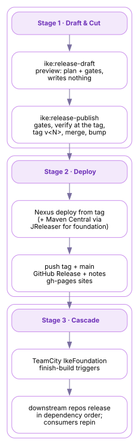

# The IKE Release Pipeline

A **release** turns one repository at a `SNAPSHOT` version into an immutable, signed, published artifact set — tagged in git, deployed to Nexus (and, for the foundation, to Maven Central), announced as a GitHub Release with generated notes. One command, `ike:release-publish`, runs it; a TeamCity cascade chains releases across the whole foundation in dependency order with one button.

This page explains the machinery end to end: the gates and the local cut, the external deploys, and the CI cascade. It is written for two readers — an **operator** who needs to cut a release, and an **engineer** who needs to understand or change how the pipeline works. Each stage closes with a **Where the machinery lives** note pointing into the source. Its sibling page, [the IKE Checkpoint Pipeline](checkpoint-pipeline.html)[1], covers the other publication path: workspace-wide snapshots that become installers rather than versioned artifacts.

## [#the-three-stages](#the-three-stages)The three stages

 

| Stage | What happens | Where it runs |
| --- | --- | --- |
| **1 · Draft & Cut** | `ike:release-draft` previews the whole plan without writing; then `ike:release-publish` runs the gates, builds and verifies the release state, and completes **all** git work — tag `v<N>`, merge to `main`, bump to the next `SNAPSHOT` — before anything external happens. | Operator’s machine or CI agent, via the `ike` plugin (`ike-tooling`). |
| **2 · Deploy** | Artifacts deploy to Nexus from the tag; foundation repos additionally publish to Maven Central through JReleaser. The tag and `main` are pushed, a GitHub Release is created with a generated changelog, and the project and organization sites deploy to `gh-pages`. | Same build, external phase. |
| **3 · Cascade** | Downstream repositories release in dependency order — locally via `ike:release-cascade`, or one-button on TeamCity, where finish-build triggers chain the seven foundation release configurations. | CI (TeamCity project **IkeFoundation**, agent `kec`). |

## [#stage-1--draft-gate-and-cut](#stage-1--draft-gate-and-cut)Stage 1 — Draft, gate, and cut

The goal ships as a **draft / publish pair** — the same convention used throughout the IKE plugins — so you can preview before you mutate:

`ike:release-draft` Read-only preview. Resolves the release version, runs the gates, and prints the exact plan — version movement, the reproducible build timestamp, every deploy target, and the point where local work ends and external actions begin — writing nothing. `ike:release-publish` The mutation. It refuses to start unless the gates pass, in order: 

1. **Clean working tree** — a release is cut from committed state only.
2. **Milestone gate** — a milestone named `<artifact> v<N>` must exist on the issue tracker. Releases are planned events with a place for their issues, never accidents.
3. **Warning-free javadoc** — the API documentation builds clean, because it ships with the artifacts.
4. **Coherence and parent guards** — the release coordinates are read from the Maven model itself (group inheritance resolved from the `<parent>` block, the version required to be the project’s own), and a `SNAPSHOT` parent blocks the cut.

The local phase then does all the git work in one deterministic sequence: a `release/<N>` branch, versions set from `SNAPSHOT` to `<N>`, a reproducible `project.build.outputTimestamp` stamped, `2` references resolved, a full `clean verify` **at the release state**, the commit and tag `v<N>`, source-POM state restored, the merge back to `main`, and the bump to the next `SNAPSHOT`.

**Everything local completes before anything external starts.** A failure in a later stage — a network error at Nexus, a Central validation — never leaves half-published git state: the tag, merge, and version bump are already coherent, and the external phase can be retried from them.

**Operator quickstart** — from the repository root, secrets injected from 1Password (signing runs in-process; no keys on disk):

```
# 1. Preview the plan — gates, versions, deploy targets
./mvnw ike:release-draft

# 2. Cut and publish
op run --env-file ~/.config/ike/release.env -- ./mvnw ike:release-publish -B
```

The public step-by-step how-to, including failure recovery, is [Cutting a Release](https://ike.network/ike-platform/cutting-a-release.html)[2] on the `ike-platform` site. Workspace-scoped releases (a workspace reactor and its subprojects as one train) ride the same engine through the `ws:release-draft` / `ws:release-publish` pair.

Where the machinery lives  

Module `ike-maven-plugin` in **ike-tooling**, package `network.ike.plugin.release` — one sub-package per phase, run in order: `prep`, `local`, `coherence`, `nexus`, `central`, `finalize`, `report`.

- `ReleaseDraftMojo` — `@Mojo(name = "release-draft")`; the read-only plan.
- `ReleasePublishMojo` — `@Mojo(name = "release-publish")`; gates + phases.
- `ReleaseSupport` and `ReleaseNotesSupport` in module `ike-workspace-model` — the shared release engine: model-based coordinate reading, version movement, and changelog derivation. The `ws:` workspace release goals consume the same classes.

Repository: [IKE-Network/ike-tooling](https://github.com/IKE-Network/ike-tooling)[3].

## [#stage-2--deploy-and-publish](#stage-2--deploy-and-publish)Stage 2 — Deploy and publish

With the tag cut, the external phase publishes from it:

**Nexus** — every release deploys to the internal Nexus repositories (`SNAPSHOT` builds flow there continuously between releases; a release is the immutable point in that stream).

**Maven Central** — foundation repositories that opt in (`<ike.publishToCentral>true</ike.publishToCentral>`) additionally publish through JReleaser:

- a **signed staging deploy** renders the consumer POMs (Maven 4’s model-4.0.0 transformation; the internal `-build.pom` is pruned from the bundle);
- the **generated-BOM swap** replaces the stub `ike-bom` POM with the real generated one — resolved `<dependencyManagement>`, license, developer, and SCM metadata — re-signs it, and verifies the result;
- **JReleaser** validates the bundle with `applyMavenCentralRules` and uploads. The default asynchronous path renders a version-pinned script that runs `ike:central-stage`, so the staging logic is always the releasing plugin’s own, never a stale pin’s.

**GitHub** — the tag and `main` are pushed, and a GitHub Release is created whose body comes from the release-notes machinery (`ike:release-changelog`): entries derived from commit `Refs:`/`Fixes:` trailers and the release milestone, so the human-readable "what changed" is generated, not hand-written.

**Sites** — the project’s Maven site deploys to its `gh-pages`, and the organization landing at [ike.network](https://ike.network/)[4] re-registers the project, so published documentation tracks released reality.

Where the machinery lives  

Phases `nexus`, `central`, and `finalize` under `network.ike.plugin.release` (**ike-tooling**); `ike:central-stage` is the version-pinned staging goal the async path invokes. JReleaser and signing configuration are inherited from [ike-base-parent](https://github.com/IKE-Network/ike-base-parent)[5] — the Tier-0 parent every foundation repository extends. Signing uses the in-process Bouncy Castle signer with secrets injected via `op run`; no private key material lives on disk.

## [#stage-3--the-cascade](#stage-3--the-cascade)Stage 3 — The cascade

A foundation release rarely travels alone: downstream repositories pin their upstream versions explicitly (property-indirected pins, moved deliberately — releases **roll forward**, never republish). Two mechanisms carry a change through the graph:

**Locally**, `ike:release-cascade` releases the foundation in dependency order from one command, repinning as it goes.

**On CI**, TeamCity project **IkeFoundation** holds seven release configurations on one uniform template (`./mvnw -B -ntp ike:release-publish`), pinned to agent `kec` — the signing identity. Finish-build triggers chain them:

```
BaseParentRelease (manual apex — no trigger)
  ├─→ JavaSupportRelease ──→ VersionMgmtExtRelease
  │                      └─→ ToolingRelease ──→ DocsRelease ──┐
  └─→ WorkspaceExtRelease ────────────────────────────────────┴─→ PlatformRelease
```

Fire any node and everything downstream auto-releases. The operating rule is **trigger the lowest node that covers the change**: a `build-standards` change starts at `ToolingRelease`; a platform-only change fires `PlatformRelease` alone.

Each node is an **irreversible** release — tag, Nexus, and (for opted-in repos) Maven Central. The cascade is one-button by design; the completeness sweep happens before the button, not after.

Announcements ride the same shared notifier the checkpoint pipeline uses: `notify-zulip.sh` posts progress and a final changelog summary to Zulip, best-effort, never failing a release.

Where the machinery lives  

- `IkeReleaseCascadeMojo` (`ike:release-cascade`) in **ike-tooling** — the local dependency-ordered cascade.
- TeamCity configuration (Kotlin DSL) and `notify-zulip.sh` in [ike-ci](https://github.com/IKE-Network/ike-ci)[6] (`.teamcity/`); the release configs regenerate from `scratch/tc/create-foundation-release-configs.py`.
- The operator-facing CI topology and REST trigger recipes are documented in `release-operations.adoc` in **ike-infrastructure**.

## [#source-repositories](#source-repositories)Source repositories

| Repository | What it contributes |
| --- | --- |
| [ike-tooling](https://github.com/IKE-Network/ike-tooling)[3] | The `ike:release-*` goals, the phase engine, Central staging, and the changelog machinery (Stages 1–3). |
| [ike-base-parent](https://github.com/IKE-Network/ike-base-parent)[5] | Inherited JReleaser + signing configuration (Stage 2). |
| [ike-platform](https://github.com/IKE-Network/ike-platform)[7] | The `ws:release-*` workspace release train, and the public [Cutting a Release](https://ike.network/ike-platform/cutting-a-release.html)[2] how-to (Stage 1). |
| [ike-ci](https://github.com/IKE-Network/ike-ci)[6] | The TeamCity foundation cascade and `notify-zulip.sh` (Stage 3). |
